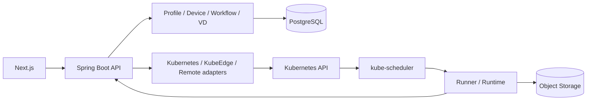

# 아키텍처

Spring Boot modular monolith를 신규 Control Plane으로 만든다.
Next.js는 사용자의 명령과 상태 표시를 담당하고 최종 Node 배치는 kube-scheduler가 수행한다.



위 그림은 목표 구조다. 현재 M3에서는 Next.js → Spring Boot → PostgreSQL의 Profile·Device
관리, 세션·관측·연결 이력과 Kubernetes Node 읽기 adapter, 불변 Workflow DAG와
Run/Task/Attempt의 생성·조회·취소를 구현했다. 실제 Kubernetes 작업 실행과 결과는 M4 범위다.
현재 M4에는 실행 규격 검증·Job compiler·S3 artifact adapter·독립 Python Runner가 추가됐다.
V5와 RuntimeLifecycleService는 실행 상태·producer claim·명령 lease·검증된 결과 확정·BATCH 해제·취소를
같은 Run 행 잠금 아래 연결한다. Kubernetes worker와 내부 Runner HTTP 인증/API는 구현했다.
로컬 실행 기본값은 비활성이며 배포는 저장소·키·이미지를 연결하고 활성화했다. 실제 root Result까지
확인했고 전체 BATCH 실행·실패/취소와 실제 kind 게이트도 통과했다. M4 완료 증거를 따른다.
M5는 Run별 RetryPolicy·V6 task_retry 예약과 RETRY_WAIT를 추가한다. 기존 Run 잠금으로 재시도·취소·commit을
직렬화하고 실제 이전 Runtime 종료 후 새 Attempt/epoch를 만든다. V7 task_offload와 OffloadService는
명시적인 실행 중 NODE 전환을 같은 잠금으로 처리한다. 이전 producer 차단→물리 종료→새 Attempt 및
target claim 확인 순서이며 Operation 성공과 Task 결과 성공을 구분한다. 실제 배치는 scheduler가 담당한다.
상태형 checkpoint·STREAM route와 실제 외부 Remote 계약 수용은 남은 범위다.
V8 runtime_telemetry는 현재 producer가 보고한 cgroup 사용량과 서비스 지연을 Attempt별 최신64개로
보존한다. Runner 내부 인증과 Run 잠금으로 종료된 producer를 차단하며 Task 상세는 최신 Attempt의
측정만 제공한다. 측정 수집과 자동 전환의 판단·실행은 별도 단계다(ADR0008).
ADR0009/V9는 연속된 실제 측정·warmup/cooldown·전환 예산과 판단 이력을 보존하고 이전 노드를
제외한 AUTO 재배치를 수행한다. 실제 kind/CI/배포에서 검증했다.
ADR0010의 RemoteGateway는 allocation/run/task/attempt/epoch를 사용하는 내부 경계다.
HTTP 참조 adapter와 SQLite 기반 합성 제공자를 실제 HTTP/TLS·별도 프로세스 및 CI에서 검증했다.
ADR0011/V10–V11은 RuntimeInstance와 RemoteAllocation을 1:1로 연결하고 Kubernetes/Remote 명령
조회를 분리한다. Remote 결과는 allocation 신원을 가지며 Job/Pod/Node UID는 null이다. 제공자의 성공
관측만으로 결과를 확정하지 않고 실제 S3 검증 후 현재 Attempt/epoch/lease/취소를 다시 확인한다.
결과 API·화면에서 SYNTHETIC 참조 계산을 표시한다. 이 내부 경로는 실제 DB/S3/HTTP와 CI·배포를 검증했다.
ADR0012/V12는 공개 REMOTE Run/Offload부터 제공자 binding을 고정하고 RemoteWorker가 명령/관측과
직접 S3 입출력 전송을 수행한다. 외부 I/O는 DB 트랜잭션 밖이며 Result 확정 때 producer를 재검사한다.
실제 Spring 스케줄러·공개 HTTP·제공자·DB/S3는 로컬 검증했다. 실제 Kubernetes↔Remote 종단과 외부
계약 수용은 남았다. 상세 검증 및 한계는 `docs/evidence/m5-remote-worker.md`를 따른다.

| 경로 | 책임 |
|---|---|
| backend/app | 실행 진입점, controller, service, DTO, 인증·설정·예외 처리 |
| backend/domain | 외부 SDK에 의존하지 않는 도메인 모델과 저장소 인터페이스 |
| backend/adapters | PostgreSQL 저장소·Kubernetes Node/Job/Pod/신원 adapter·Job compiler·S3 artifact·Remote 참조 HTTP 구현, 추후 KubeEdge·MQTT |
| dashboard | 사용자 UI, 계약에서 생성한 API 타입 |
| runner | M4 Python workload 실행·artifact 전송·commit 요청; 내부 API·배포 전체 경로 검증 완료 |
| simulator | 영속 Remote 참조 계산·장애 재현. 장치 시뮬레이션은 미구현; 실장비 증거와 분리 |
| contracts | 구현 전에 확정하는 OpenAPI |
| deploy | 개발 Compose, GitOps 배포 manifests, 추후 격리 kind 시험 |

PostgreSQL은 관리 상태·결과 metadata, Object Storage는 대형 artifact,
MQTT는 장치 스트림을 담당한다. 네 물리/논리 객체 Device·Node·VD·Runtime은 구분한다.

## 백엔드 패키지 구조

Java 패키지는 역할별 계층으로 나눈다. 실행 모듈의 `io.edgeai.app` 바로 아래에는
`EdgeAiApplication`만 두고, 컨트롤러·서비스·설정은 각각 해당 패키지에 둔다.
Gradle의 세 모듈은 하나의 Spring Boot 서버로 조립된다.

```text
backend/
├── app/src/main/java/io/edgeai/app/
│   ├── EdgeAiApplication.java
│   ├── controller/   # HTTP 엔드포인트: Profile, Device, Node, Workflow, WorkflowRun, Task, Platform, CSRF
│   ├── service/      # Profile/Device/Workflow/Execution, Runtime lifecycle·결과 확정, 트랜잭션
│   ├── dto/          # API 응답·페이지·오류 DTO
│   ├── config/       # Security, Swagger UI, 저장소 빈 조립
│   ├── exception/    # 예외 타입 및 HTTP 오류 응답 변환
│   └── support/      # JSON 파싱·정규화, DAG 입력 검증
├── domain/src/main/java/io/edgeai/domain/
│   ├── profile/      # ProfileIdentity, ProfileVersion
│   ├── device/       # Device, Attachment, Session, Observation
│   ├── node/         # ExecutionNode, NodeInventory port
│   ├── workflow/     # Dag, WorkflowVersion, TaskDefinition
│   ├── execution/    # WorkflowRun, Task, TaskAttempt
│   ├── runtime/      # 실행 규격·자원·배치 입력, RuntimeInstance·명령 lease·Pod 신원
│   ├── storage/      # Artifact 계약·봉인된 TaskResult·저장소 port
│   ├── remote/       # 원격 신원·불변 할당/제공자 binding·파일·관측·gateway port
│   └── repository/   # 저장소 인터페이스
└── adapters/src/main/java/io/edgeai/adapters/
    ├── kubernetes/   # 실제 Node API, CA/token/pagination, 순수 Job compiler
    ├── storage/      # 고정 bucket·object version·내용 검증
    ├── remote/       # 참조 제공자 HTTP/TLS·파일 전송
    └── repository/   # Profile/Device/Node/Workflow/Execution/Runtime/Remote JDBC 구현
```

요청 처리는 `controller → service → ProfileRepository → JdbcProfileRepository` 순서다.
컨트롤러는 HTTP 상태와 DTO 변환을 담당하고, 서비스는 등록·조회 흐름과 트랜잭션을 담당한다.
저장소 인터페이스는 순수 Java 모듈에 두고 PostgreSQL 구현은 `config`에서 연결한다.
`ProfileJson`의 기존 파싱·정규화·digest 계산은 `support`에 모아 기존 동작을 유지한다.

`src/main/resources`에는 서버 설정·Swagger 자산·Flyway migration을 둔다.
테스트는 `src/test/java/io/edgeai/app/` 아래 `controller`, `config`, `support`,
`integration`으로 구분한다. OpenAPI 주소·응답 형식·DB 스키마는 패키지 재배치로 변경하지 않는다.

ADR0009/V9에서 Run의 선택적 offload 정책을 저장하고 OffloadWorker가 실행 중 최신 표본을 평가한다.
연속된 같은 지표·freshness·warmup/cooldown·한도를 만족하면 Run 잠금에서 판단 근거와 전환을
원자적으로 저장한다. 자동 위치는 이전 실행 노드를 제외하는 AUTO 제약이며 kube-scheduler가
선택한다. 이전 노드로 돌아가지 않으며 실패한 producer의 재시도는 기존 retry 경로로 분리한다.


## VD 등록과 원본 연결 (ADR0013/V13)

VirtualDevice는 불변 VD/SERVICE Profile 버전을 참조하고 원본 Device와 별도 ID를 가진다.
VDSourceBinding은 slot별 현재 연결과 열린/닫힌 revision을 보존한다. API 수정은 VD 행을 잠그고
원본 Device UUID 순서로 잠근다. 장치 해제와 연결을 직렬화하며 활성 binding의 Device 해제는409다.
DB 복합 FK·활성 UNIQUE·이력 변경 차단과 지연 제약으로 필수 source 집합·해제 상태도 검증한다.

이는 등록 계층이다. 지속 VD runtime과 Operation은 아래 계층에서 관리하며 실제 Task 실행은 아직 연결하지 않았고
기존 TaskAttempt Job이나 Node ID를 VD runtime으로 취급하지 않는다. 상세는 ADR0013과 M6 요구사항을 따른다.

ADR0014의 순수 `KubernetesVDPodCompiler`는 고정 SERVICE 이미지의 지속 Pod를 만든다.
`runner/vd.py`는 runtime/generation/session/lease에 묶인 poll로 작업을 받고, 작업마다 기존 Runner를
별도 session에서 실행한다. Pod 자체는 Task·Job과 독립이며 자원은 동시 작업이 공유한다.
ADR0015/V14는 실행 세대·설정 스냅샷·runtime binding 이력·Operation과 CREATE/DELETE lease를
저장한다. VD 행 잠금 아래 원본 교체/해제와 drain 요청을 연결하고 이전 세대 종료 확인 후 새 세대를
만든다. ADR0016의 `KubernetesVDGateway`/`VDWorker`는 실제 Pod 생성·신원·목록/감시·UID 삭제를
명령 lease와 연결한다. Secret UID 소유 관계와 종료 이력으로 늦은 Pod를 정리하며 관측만으로
Ready를 부여하지 않는다. `EDGEAI_VD_ENABLED=false`가 기본값이다.
ADR0017/V15는 HMAC/Pod 신원 인증·순번 receipt·lease/Ready·idle drain과 supervisor 자체 교체 요청을
서버 poll에 연결한다. 현재 배정은 비어 있으며 미배정 완료 보고를 수용하지 않는다.
ADR0018은 공개 provision/replace/drain·execution 스냅샷과 Operation 합집합 조회 및 UI를 연결한다.
VD Run 배정과 실제 Task/Result는 아직 연결하지 않았다.
공개 등록만으로 VD를 Ready 또는 실행 가능으로 표시하지 않는다.

ADR0019/V16은 VD Run/Attempt의 불변 대상, 작업별 VD RuntimeInstance와 VDTaskAllocation을
저장한다. allocation은 지속 runtime의 세대/session/Pod와 slot·poll sequence에 결합하며,
실제 종료 확인 후 slot을 닫는다. Result는 allocation의 Pod/vdRuntimeId를 FK로 참조한다.
Run 잠금은 VD→Run 순서를 사용한다. 현재 이 영속 기반의 실제 DB 검증까지이며
공개 VD Run과 poll·Runner 인증/Result 서비스 연결은 후속이다.
