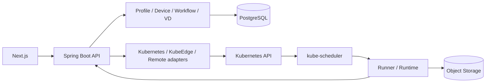

# 아키텍처

Spring Boot modular monolith를 신규 Control Plane으로 만든다.
Next.js는 사용자의 명령과 상태 표시를 담당하고 최종 Node 배치는 kube-scheduler가 수행한다.



위 그림은 목표 구조다. 현재 M3에서는 Next.js → Spring Boot → PostgreSQL의 Profile·Device
관리, 세션·관측·연결 이력과 Kubernetes Node 읽기 adapter, 불변 Workflow DAG와
Run/Task/Attempt의 생성·조회·취소를 구현했다. 실제 Kubernetes 작업 실행과 결과는 M4 범위다.
현재 M4에는 실행 규격 검증·Job compiler·S3 artifact adapter·독립 Python Runner가 추가됐다.
V5와 RuntimeLifecycleService는 실행 상태·producer claim·명령 lease·검증된 결과 확정·BATCH 해제·취소를
같은 Run 행 잠금 아래 연결한다. Kubernetes worker와 내부 Runner HTTP 인증/API는 구현했다.
로컬 실행 기본값은 비활성이며 배포는 저장소·키·이미지를 연결하고 활성화했다. 실제 root Result까지
확인했고 전체 BATCH 실행·실패/취소와 실제 kind 게이트도 통과했다. M4 완료 증거를 따른다.
M5는 Run별 RetryPolicy·V6 task_retry 예약과 RETRY_WAIT를 추가한다. 기존 Run 잠금으로 재시도·취소·commit을
직렬화하고 실제 이전 Runtime 종료 후 새 Attempt/epoch를 만든다. running offload·Remote는 후속 구현이다.

| 경로 | 책임 |
|---|---|
| backend/app | 실행 진입점, controller, service, DTO, 인증·설정·예외 처리 |
| backend/domain | 외부 SDK에 의존하지 않는 도메인 모델과 저장소 인터페이스 |
| backend/adapters | PostgreSQL 저장소·Kubernetes Node/Job/Pod/신원 adapter·Job compiler·S3 artifact 구현, 추후 KubeEdge·MQTT·remote 경계 |
| dashboard | 사용자 UI, 계약에서 생성한 API 타입 |
| runner | M4 Python workload 실행·artifact 전송·commit 요청; 내부 API·배포 전체 경로 검증 완료 |
| simulator | 장치·Remote·장애 재현; 실장비 증거와 분리 |
| contracts | 구현 전에 확정하는 OpenAPI |
| deploy | 개발 Compose, GitOps 배포 manifests, 추후 격리 kind 시험 |

PostgreSQL은 관리 상태·결과 metadata, Object Storage는 대형 artifact,
MQTT는 장치 스트림을 담당한다. 네 물리/논리 객체 Device·Node·VD·Runtime은 구분한다.

## 백엔드 패키지 구조

Java 패키지는 역할별 계층으로 나눈다. 실행 모듈의 `io.edgeai.app` 바로 아래에는
`EdgeAiApplication`만 두고, 컨트롤러·서비스·설정은 각각 해당 패키지에 둔다.
Gradle의 세 모듈은 하나의 Spring Boot 서버로 조립된다.

```text
backend/
├── app/src/main/java/io/edgeai/app/
│   ├── EdgeAiApplication.java
│   ├── controller/   # HTTP 엔드포인트: Profile, Device, Node, Workflow, WorkflowRun, Task, Platform, CSRF
│   ├── service/      # Profile/Device/Workflow/Execution, Runtime lifecycle·결과 확정, 트랜잭션
│   ├── dto/          # API 응답·페이지·오류 DTO
│   ├── config/       # Security, Swagger UI, 저장소 빈 조립
│   ├── exception/    # 예외 타입 및 HTTP 오류 응답 변환
│   └── support/      # JSON 파싱·정규화, DAG 입력 검증
├── domain/src/main/java/io/edgeai/domain/
│   ├── profile/      # ProfileIdentity, ProfileVersion
│   ├── device/       # Device, Attachment, Session, Observation
│   ├── node/         # ExecutionNode, NodeInventory port
│   ├── workflow/     # Dag, WorkflowVersion, TaskDefinition
│   ├── execution/    # WorkflowRun, Task, TaskAttempt
│   ├── runtime/      # 실행 규격·자원·배치 입력, RuntimeInstance·명령 lease·Pod 신원
│   ├── storage/      # Artifact 계약·봉인된 TaskResult·저장소 port
│   └── repository/   # 저장소 인터페이스
└── adapters/src/main/java/io/edgeai/adapters/
    ├── kubernetes/   # 실제 Node API, CA/token/pagination, 순수 Job compiler
    ├── storage/      # 고정 bucket·object version·내용 검증
    └── repository/   # Profile/Device/Node/Workflow/Execution/Runtime JDBC 구현
```

요청 처리는 `controller → service → ProfileRepository → JdbcProfileRepository` 순서다.
컨트롤러는 HTTP 상태와 DTO 변환을 담당하고, 서비스는 등록·조회 흐름과 트랜잭션을 담당한다.
저장소 인터페이스는 순수 Java 모듈에 두고 PostgreSQL 구현은 `config`에서 연결한다.
`ProfileJson`의 기존 파싱·정규화·digest 계산은 `support`에 모아 기존 동작을 유지한다.

`src/main/resources`에는 서버 설정·Swagger 자산·Flyway migration을 둔다.
테스트는 `src/test/java/io/edgeai/app/` 아래 `controller`, `config`, `support`,
`integration`으로 구분한다. OpenAPI 주소·응답 형식·DB 스키마는 패키지 재배치로 변경하지 않는다.
