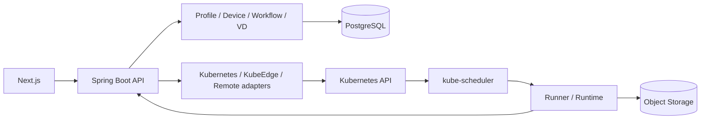

# 아키텍처

Spring Boot modular monolith를 신규 Control Plane으로 만든다.
Next.js는 사용자의 명령과 상태 표시를 담당하고 최종 Node 배치는 kube-scheduler가 수행한다.

위 그림은 목표 구조다. M0의 실제 경로는 Next.js readiness → Spring Boot readiness → PostgreSQL이며,
상태 메타데이터 API 외의 도메인 기능과 외부 adapter는 아직 구현하지 않았다.

| 경로 | 책임 |
|---|---|
| backend/app | API, 인증, 트랜잭션, 추후 controller/reconciliation |
| backend/domain | 외부 SDK에 의존하지 않는 도메인 모델 |
| backend/adapters | Kubernetes, KubeEdge, storage, MQTT, remote 경계 |
| dashboard | 사용자 UI, 계약에서 생성한 API 타입 |
| runner | 후속 M4 실행·결과 커밋 프로세스 |
| simulator | 장치·Remote·장애 재현; 실장비 증거와 분리 |
| contracts | 구현 전에 확정하는 OpenAPI |
| deploy | 개발 Compose, 추후 격리 kind/운영 manifests |

PostgreSQL은 관리 상태·결과 metadata, Object Storage는 대형 artifact,
MQTT는 장치 스트림을 담당한다. 네 물리/논리 객체 Device·Node·VD·Runtime은 구분한다.
