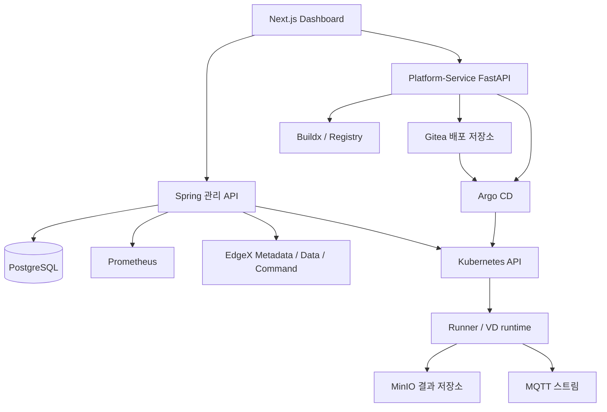

# 아키텍처

EdgeAI의 관리 API는 Spring Boot modular monolith이고, Dashboard는 Next.js입니다.
관리 상태는 PostgreSQL에 저장하며 외부 시스템과의 통신은 adapter 계층에서 처리합니다.

## 전체 구조

Spring 실행과 Platform-Service의 DDS 배포는 별도 경로입니다.
Gitea에 YAML이 저장됐다는 사실을 Spring Run 또는 Result로 변환하지 않습니다.

## 관리·관측·실행 경계

| 경계 | 책임 | 완료 판단 |
|---|---|---|
| 관리 | 프로필·장치·VD·워크플로 버전·변경 기록 저장 | API 응답과 저장된 리소스 |
| 관측 | Kubernetes, Prometheus, EdgeX의 실제 값 조회 | 원본 상태·시각·수집 성공 |
| Spring 실행 | Run·Task·Attempt 배정, 종료, 결과 검증 | Task와 확정 Result |
| DDS 배포 | 이미지 빌드와 GitOps 반영 | Git·Argo·실제 Pod와 서비스 |

Dashboard는 고정된 서버 측 프록시를 통해 요청합니다. 브라우저가 임의의 Kubernetes,
Prometheus, EdgeX 주소를 지정하여 직접 제어하지 않습니다.
접근 제어의 현재 범위는 [접근과 요청 보호](../reference/access.md)에 설명합니다.

## 백엔드 패키지 구조

| 모듈·패키지 | 책임 |
|---|---|
| `backend/domain` | 도메인 모델, 규칙, 저장소·외부 기능 인터페이스 |
| `backend/adapters` | PostgreSQL, Kubernetes, Prometheus, EdgeX 등 구현 |
| `backend/app/controller` | HTTP 입력과 응답 |
| `backend/app/service` | 트랜잭션과 유스케이스 |
| `backend/app/dto` | 요청·응답 모델 |
| `backend/app/config` | Spring 조립, 보안 필터, worker 구성 |
| `backend/app/exception` | 오류와 HTTP 상태 변환 |
| `backend/app/support` | JSON·검증 등 공통 처리 |

실제 Java 패키지는 `io.edgeai.app` 아래에 있습니다. `domain`이 Kubernetes·S3·MQTT를 직접 호출하지 않습니다.
설정과 Flyway migration은 `backend/app/src/main/resources`에 있습니다.

## 데이터와 수명

프로필·워크플로 버전은 발행 내용이 고정됩니다. Device 세션, VD 원본 연결, runtime 세대와
Attempt를 분리해 교체·재시도 뒤에도 원래 실행 주체를 식별합니다.
원본 장치 해제와 VD 연결 변경은 트랜잭션·참조 제약으로 보호합니다.

VD는 지속 supervisor Pod 안에서 자식 Runner를 실행할 수 있습니다. 등록 레코드, supervisor 실행,
자식 Task 실행은 다른 신원이며 완료 이력이 남아 있는 VD 등록은 영구 삭제할 수 없습니다.

센서 Reading과 대형 결과 파일은 관리 DB 메타데이터와 구분합니다.
파일 결과는 고정 객체 버전과 내용 검증 후 확정합니다. 재시작 복구가 전체 플랫폼의 재가동을 자동 보장하지는 않습니다.

## 더 읽기

- [리소스 모델](../concepts/resources.md), [워크플로 모델](../concepts/workflows.md)
- [DB 구조 참고](erd.md), [API 참고](../reference/api.md)
- [운영과 복구](../operations/overview.md), [설계 결정 모음](../adr/)
