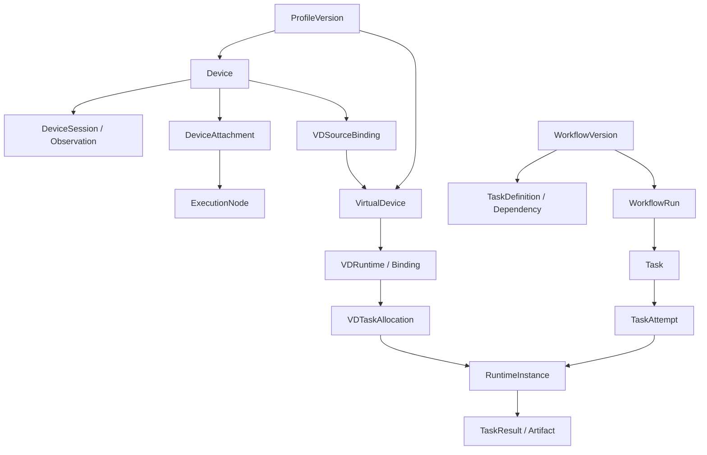

# 데이터 모델과 DB 제약

실제 schema의 기준은 `backend/app/src/main/resources/db/migration`의 Flyway migration입니다.
아래는 주요 관계를 이해하기 위한 요약이며 전체 컬럼·인덱스·제약을 대체하지 않습니다.

## 주요 관계

## 식별과 이력

| 영역 | 유지하는 식별·수명 |
|---|---|
| 프로필·워크플로 버전 | 종류·키·버전과 고정 내용 |
| 장치 | 등록 ID, 현재 세션, 증가하는 관측 sequence |
| 가상 장치 | 등록 revision, 원본 연결 이력, runtime 세대·session·lease |
| 작업 | Run·Task·Attempt, producer·runtime 신원 |
| 스트림 | data route, generation, checkpoint와 완료 이력 |
| 감사 | 접수 ID와 별도 HTTP 결과 |

등록과 실행은 별도 테이블·수명입니다. VD의 supervisor runtime과 자식 Task runtime을 같은 ID로 취급하지 않습니다.
고정 Result와 객체 버전 참조는 실행 재시도 뒤에도 원래 주체를 식별해야 합니다.

## 삭제와 변경 보호

발행 버전의 내용을 UPDATE로 덮어쓰지 않습니다. V42는 미사용 프로필·장치 등록 삭제를,
V43은 해제된 미사용 VD 등록 삭제를 지원합니다. 따라서 초기 migration의 DELETE 차단 설명만으로
현재 삭제 가능 여부를 판단하지 않습니다.

활성 연결, FK, 실행·작업 이력과 트리거가 삭제 조건을 검사합니다.
VD 영구 삭제는 runtime·Operation 등 완료 이력도 참조로 취급합니다.
감사·실행 이력을 일괄 삭제하는 기능과 등록 정리는 별개입니다.

## 변경 시 확인

새 schema 변경은 기존 migration을 수정하지 않고 새 버전으로 추가합니다.
트랜잭션, 동시 등록·수정, 원본 해제와 VD 연결, 이력 보존을 실제 PostgreSQL에서 검증합니다.
API·DB 조합의 버전과 복구 도구의 지원 schema를 함께 확인합니다.

관련 문서: [아키텍처](architecture.md), [리소스 모델](../concepts/resources.md), [개발 참여](../contributing/development.md).
