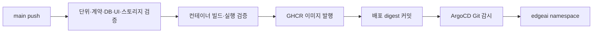

# GitHub Actions → GHCR → Git → ArgoCD

`main` push 시 기존 `scaffold`/`storage` 검증을 통과한 커밋만 이미지를 만든다.
`images` job은 backend와 standalone Dashboard 컨테이너를 빌드한 뒤 별도 PostgreSQL과
함께 실행해 실제 HTTP 경로를 검증한다. 검증한 동일 이미지를 GHCR에 발행한다.
`gitops` job은 두 이미지의 SHA-256 digest와 소스 커밋을 Git에 기록한다.

2026-10-02 첫 실제 연결을 확인했다. [Actions 36958143060](https://github.com/dsa04156/edgeai/actions/runs/36958143060)의
네 job이 성공했고, Git digest 자동 커밋·ArgoCD 동기화·세 Pod Ready·배포 HTTP 검증까지 통과했다.
API/Dashboard의 실행 imageID가 CI에서 발행한 digest와 일치한다. 원시 결과와 상세 상태는 [PROGRESS](../PROGRESS.md)에 기록한다.



## Git과 이미지

- 저장소: `https://github.com/dsa04156/edgeai.git`, 브랜치 `main`.
- 이미지: `ghcr.io/dsa04156/edgeai-api`, `ghcr.io/dsa04156/edgeai-dashboard`.
- 식별 태그: `sha-<전체 소스 커밋>`. 실제 배포는 태그 대신 digest를 사용한다.
- Kubernetes PostgreSQL은 Docker Official Images의 ECR Public 미러를 사용한다.
  CI에서 검증한 Docker Hub 이미지와 동일한 digest이며, 실제 노드의 Docker Hub CDN 연결
  reset이 반복되어 같은 노드에서 ECR 이미지 실행을 확인한 후 전환했다.
- 배포 상태: `deploy/kubernetes/overlays/dev/kustomization.yaml`과 `release.json`.
- 이미지 변경은 `deploy: pin verified images ... [skip ci]` 커밋으로 기록한다.
  `GITHUB_TOKEN`으로 만든 커밋은 후속 Actions 실행을 재귀적으로 만들지 않는다.
- 더 최신 `main` 커밋이 있으면 이전 실행의 이미지로 배포 설정을 덮어쓰지 않는다.
  push 경쟁은 non-fast-forward로 실패하며 강제 push하지 않는다.
- PR에서는 기존 CI가 실행되며 이미지 발행·배포 변경은 `main` push에서만 수행한다.

Actions는 job별 `packages: write`, `contents: write` 권한을 사용한다.
GitHub에 Kubernetes 관리자 kubeconfig나 ArgoCD 비밀번호를 저장할 필요가 없다.
공개 Git 저장소는 ArgoCD가 별도 Git 자격 증명 없이 읽는다.

GHCR 최초 발행 패키지의 공개 범위는 별도 설정이다. 공개 소스만 포함한 두 이미지를
Public으로 설정하면 노드는 자격 증명 없이 pull할 수 있다. Private을 유지한다면
장기 운영용 `read:packages` 자격 증명의 imagePullSecret을 별도로 연결해야 한다.
수명이 짧은 Actions `GITHUB_TOKEN`을 Kubernetes pull 비밀번호로 저장하지 않는다.

## 확인한 개발 클러스터와 접속

- context: `kubernetes-admin@kubernetes`, 기존 ArgoCD namespace: `argocd`.
- ArgoCD: `http://argocd.192.168.0.56.sslip.io` 또는 `http://argocd.10.254.192.217.nip.io`.
- Application: `edgeai-dev`, 전용 AppProject: `edgeai`, 대상 namespace: `edgeai`.
- Dashboard: `http://edgeai.192.168.0.56.sslip.io` 또는 `http://edgeai.10.254.192.217.nip.io`.
- Swagger: 위 EdgeAI 주소의 `/swagger-ui.html`.
- IngressClass `traefik`, 기본 StorageClass `local-path`를 확인했다.

주소는 해당 사설망에 접근할 수 있는 환경에서 사용한다. 기존 환경을 따라 내부 HTTP로
설정했으며 외부 공개용 TLS·사용자별 권한·운영 DB HA/백업은 아직 구성하지 않았다.
현재 Basic 계정과 메모리 CSRF 세션을 쓰므로 API는 replica 1로 시작한다.
이 배포 연결은 M2+ 도메인 구현이나 M10 실장비 수용시험 완료를 뜻하지 않는다.

## 초기 연결과 확인

`scripts/bootstrap-gitops.py --context <context>`는 ArgoCD 존재와 namespace 소유 label을
확인하고, 새 `edgeai` namespace 및 전용 Secret을 생성한다. 기존 Secret은 회전하지 않는다.
초기 계정은 `.tools/kubernetes/edgeai-runtime.env`에만 보관하며 `.env`의 로컬 DB 계정과 별개다.
이미지 발행 후 다음 두 파일을 적용하면 ArgoCD가 Git의 배포 상태를 읽어 배치한다.

```bash
kubectl --context kubernetes-admin@kubernetes apply -f deploy/argocd/project.yaml
kubectl --context kubernetes-admin@kubernetes apply -f deploy/argocd/application.yaml
kubectl --context kubernetes-admin@kubernetes -n argocd get applications.argoproj.io edgeai-dev
kubectl --context kubernetes-admin@kubernetes -n edgeai get pods,svc,pvc,ingress
```

자동 동기화와 self-heal을 사용하고 자동 삭제(prune)는 끈다. 재시도는 최대 3회다.
Git 변경은 ArgoCD 기본 polling으로 반영하며 GitHub webhook은 필수 조건이 아니다.
Actions 성공은 이미지와 Git 상태 갱신의 성공이며, 배포 완료는 ArgoCD의
`Synced`/`Healthy`, 실행 중인 이미지 digest, 실제 HTTP 등록·조회까지 별도로 확인한다.

현재 환경에서 동기화는 `Synced`이며 DB/API/Dashboard는 모두 Ready다. 다만 기존 Traefik
Service는 `externalIPs`로 접속을 제공하면서 `status.loadBalancer.ingress`는 비어 있다.
Traefik의 publishedService 설정도 이 빈 상태를 Ingress에 전달하므로 ArgoCD aggregate health는
`Progressing`으로 남는다. 두 주소의 실제 HTTP와 API 기능은 통과했지만 `Healthy` 달성은 주장하지 않는다.
공유 LoadBalancer의 주소 게시 설정은 클러스터 운영 측 후속 사항이다.

## 검증과 롤백

- `scripts/test-images.sh`: 임시 Compose DB와 실제 빌드 이미지를 실행한다.
- `scripts/smoke-deployment.py`: UI/CSS, readiness/liveness, Swagger 인증,
  CSRF, Profile 등록 201·재등록 200·충돌 409·상세 조회를 확인한다.
- 로컬 Docker socket 권한이 없으면 이미지 시험은 GitHub runner에서 수행한다.
- 배포 pin을 변경할 때는 항상 두 이미지와 `release.json`의 sourceRevision을 함께 갱신한다.
- 롤백은 이전 검증 digest가 있는 배포 커밋으로 Git의 이미지 설정을 되돌린다.
  애플리케이션 이미지 롤백이 Flyway migration을 되돌리지는 않으므로 DB 호환성을 먼저 확인한다.
  V7 적용 후에는 mode/cause·OFFLOADING을 지원하지 않는 이전 API 이미지로 되돌리지 않는다.
- PostgreSQL PVC·namespace를 삭제하는 명령은 정상 종료/롤백 절차에 포함하지 않는다.

## 근거 문서

- [GitHub Actions 이미지 발행](https://docs.github.com/en/actions/tutorials/publish-packages/publish-docker-images)
- [GHCR 권한과 인증](https://docs.github.com/en/packages/working-with-a-github-packages-registry/working-with-the-container-registry)
- [ArgoCD 자동 동기화](https://argo-cd.readthedocs.io/en/stable/user-guide/auto_sync/)
- [Next.js standalone 출력](https://nextjs.org/docs/app/api-reference/config/next-config-js/output)
- [Docker Official Images ECR Public 제공](https://aws.amazon.com/blogs/containers/docker-official-images-now-available-on-amazon-elastic-container-registry-public/)
# M4 이미지 추가

Runner와 MinIO job은 각각 시험한 로컬 컨테이너를 main push에서만 GHCR에 발행한다.
scaffold/storage/runner/images가 통과하면 gitops가 API·Dashboard 배포 pin과 함께
Runner·MinIO digest를 `release.json`에 기록한다. 현재 참조 runtime 이미지 검증 플랫폼은
linux/amd64다. Runner/MinIO digest 등록만으로 실제 실행 기능이 활성화되지는 않는다.
