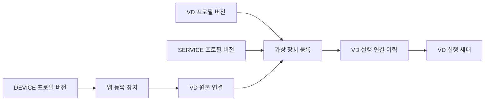

# 리소스 모델

EdgeAI는 규격, 실제 자원, 실행 인스턴스를 서로 다른 리소스로 관리합니다.
같은 장비가 여러 화면에 나타날 수 있으므로 어떤 시스템이 원본인지 먼저 확인합니다.

## 프로필

프로필은 재사용할 규격입니다. 발행된 버전의 식별자는 종류·키·버전이며 내용 digest를 보존합니다.
기존 내용을 수정하는 대신 새 버전을 발행합니다. 참조가 없는 버전만 삭제할 수 있습니다.

| 종류 | 정의하는 대상 | 소비하는 기능 |
|---|---|---|
| DEVICE | 입력 장치의 규격 | 앱 등록 장치 |
| SERVICE | 실행 이미지·입출력 등 처리 모듈 규격 | Spring DAG, 가상 장치 실행 |
| VD | 원본 슬롯·서비스 연결 등 가상 장치 규격 | 가상 장치 등록 |

규격이 저장됐다는 사실만으로 실제 장치 연결이나 이미지 실행 호환성을 보장하지 않습니다.

## 노드와 장치

**노드**는 Kubernetes가 관측하는 실행 자원입니다. 서버와 엣지 디바이스는 명시적인 노드 라벨로
분류합니다. 장비 이름이나 ARM/x86만으로 역할을 추측하지 않습니다.

**앱 등록 장치(Device)**는 EdgeAI가 관리하는 입력 장치의 신원입니다. DEVICE 프로필을 참조하며
세션과 관측 보고로 연결 상태를 관리합니다. 새로 등록한 장치는 보고를 받기 전까지 연결 상태를 알 수 없습니다.

**EdgeX 센서**의 원본은 EdgeX Device·Profile입니다. Core Metadata 목록과 Core Data 측정값을
조회합니다. EdgeAI Device 등록과 자동 동기화되는 동일한 레코드는 아닙니다.
채널별 논리 장치가 여러 개라면 물리 보드 한 대가 여러 센서 행으로 표시될 수 있습니다.

## 가상 장치

가상 장치(VD)는 물리 장치 또는 처리 기능을 표현하는 영속 논리 리소스입니다.
원본 장치와 실제 실행 위치가 바뀌어도 같은 VD ID를 유지합니다. VD 프로필은 종류,
원본 조건, SERVICE 참조, 상태 관리 방식과 실행 정책을 정의합니다.

원본 연결(Source Binding)은 어떤 장치의 데이터를 사용하는지 기록하고,
실행 연결(Runtime Binding)은 현재·과거 어떤 실행체가 VD를 구현하는지 기록합니다.
두 연결의 이력과 VD 자체를 분리합니다. 등록 상태와 실제 실행 상태는 별개이며,
등록만으로 실행 Pod를 만들거나 Ready가 되지 않습니다.

VD의 원본 교체와 실행 교체는 이력을 보존합니다. 해제와 영구 삭제의 차이는
[가상 장치 관리](../guides/virtual-devices.md)에서 설명합니다.
설계 근거는 [원래 요구사항](../requirements/m6-requirements.md)에서 확인할 수 있습니다.

## 서비스와 워크플로

SERVICE 프로필은 처리 모듈 하나의 규격이고, Spring 워크플로는 모듈들을 연결한 DAG입니다.
DDS 편집기는 별도 경로에서 Kubernetes 배포 구성을 만듭니다. [워크플로 모델](workflows.md)을 확인하세요.
