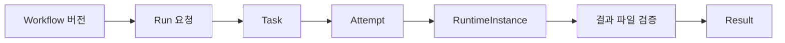

# 워크플로와 실행

Dashboard의 기본 서비스 화면은 설계서의 Spring DAG 실행입니다. 별도의 DDS·GitOps 배포 화면도 제공합니다.
두 경로 모두 워크플로 화면에서 접근하지만 같은 실행 엔진이나 결과 저장 계약을 사용하지 않습니다.

## 경로 비교

| 구분 | DDS 서비스 배포 | Spring DAG 실행 |
|---|---|---|
| 화면 | `/workflows?mode=dds` | `/workflows` (기존 `?mode=dag`도 사용 가능) |
| 구성 요소 | 센서·카메라·Discovery 템플릿 | 발행된 SERVICE 프로필 |
| 서버 | Platform-Service FastAPI | Spring 관리 API |
| 저장·배포 | Kubernetes YAML → Gitea → Argo CD | 불변 DAG 버전 → Run → Task·Attempt |
| 이미지 빌드 | 선택적인 Buildx 빌드·푸시 | 준비된 서비스 이미지 사용 |
| 결과 확인 | Argo sync/health와 실제 Pod | Run·Task·Placement·Result |
| 연결선 | 편집 정보; DDS 토픽 설정이 통신 결정 | 입력·출력 포트의 실행 의존성 |

## Spring 실행 리소스

Workflow는 이름과 버전을 관리합니다. WorkflowVersion은 발행한 DAG를 고정합니다.
Run은 특정 버전을 실행해 달라는 요청이고, Task는 DAG 작업 하나입니다.
재시도나 실행 위치 전환은 같은 Task 아래 새 Attempt를 만듭니다.

RuntimeInstance는 실제 실행과 연결하는 신원입니다. Result는 저장된 파일의 버전·내용과
현재 실행 주체를 검증한 뒤 확정합니다. Pod 종료나 Job 성공만으로 결과가 확정되지는 않습니다.

## 배치와 실행 준비

AUTO는 실행 요구조건을 Kubernetes에 전달하고 스케줄러가 노드를 선택합니다.
NODE는 관측된 노드에 대한 배치 제약을 사용합니다. VD와 REMOTE는 각각 준비된 가상 장치와
설정된 외부 제공자를 대상으로 하며 지원 모드·입력·서비스 버전 검사를 통과해야 합니다.

실행 요청 저장과 실제 실행 활성화는 별개입니다. Runner·저장소·클러스터 설정이 없으면
화면의 요청만으로 작업이 수행되지 않습니다. STREAM은 별도 broker·권한·경로 설정이 필요합니다.

## 가상 장치와 관계

VD는 단일 SERVICE 버전을 참조합니다. 전체 워크플로를 먼저 만들 필요는 없지만
해당 VD가 사용할 SERVICE·VD 프로필과 필요한 원본 장치는 준비해야 합니다.
DDS 워크플로를 저장해도 EdgeAI VD가 자동으로 생성되지는 않습니다.

다음 단계: [DDS 배포 가이드](../guides/workflow-editor-integration.md), [Spring DAG 사용](../guides/dag-execution.md).
