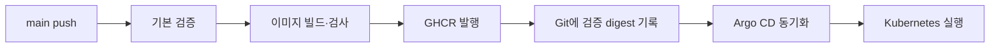

# 플랫폼 배포와 CI/CD

이 가이드는 EdgeAI API·Dashboard·Runner 이미지의 배포 흐름을 설명합니다.
사용자가 만든 DDS 서비스의 Buildx·Gitea 배포는 [서비스 배포 가이드](../guides/workflow-editor-integration.md)를 따릅니다.

## 배포 흐름



일반 push/PR은 기본 검증을 수행합니다. `main` push의 성공한 이미지와 digest를 배포 Git에 기록하고
Argo CD가 읽습니다. CI 성공과 클러스터 배포 완료는 별도로 확인합니다.

## 준비 사항

- Kubernetes context와 대상 namespace의 소유 범위
- Argo CD, Ingress, 스토리지와 runtime Secret
- 저장소·이미지 registry 접근
- 해당 배포 이미지와 호환되는 DB schema

현재 저장소의 dev overlay는 특정 개발 클러스터를 대상으로 합니다.
다른 환경에서는 `deploy/kubernetes/overlays/dev`와 `deploy/argocd`의 저장소 주소, 노드 선택,
Ingress host, StorageClass와 Secret 참조를 확인해 별도 overlay를 준비합니다.
이 문서가 임의 클러스터에 그대로 적용 가능한 범용 설치 패키지를 의미하지는 않습니다.

## 검증 모드

| 모드 | 목적 | 배포 설정 변경 |
|---|---|---|
| 일반 push/PR | 단위·계약·화면·스토리지·이미지 기본 검증 | 성공한 main push에 한해 GitOps 갱신 |
| `workflow_dispatch`, `full_verification=true` | 백업·복구·부하·실행 등 추가 검증 | gitops 단계 생략 |

정확한 job과 조건은 `.github/workflows`의 workflow가 기준입니다.
같은 브랜치의 새 실행이 이전 실행을 취소할 수 있으므로 배포 중 수동 검증의 영향을 확인합니다.
기본 검증 통과는 실모델·성능·전체 복구 수용을 뜻하지 않습니다.

## 이미지와 아키텍처

API·Dashboard는 현재 `linux/amd64` 이미지입니다. Runner는 native amd64·arm64 검증과 digest 정보를 사용합니다.
Runner 관련 소스가 바뀌지 않으면 기존 검증 이미지의 source·platform digest를 확인해 재사용할 수 있습니다.
`release.json`의 `sourceRevision`과 `runnerSourceRevision`은 서로 다를 수 있습니다.

실제 배포는 태그 대신 digest를 고정합니다. 원하는 Git revision, manifest의 digest와
실행 중 Pod의 imageID를 함께 대조합니다. 비공개 registry는 노드의 pull 자격을 별도로 구성합니다.

## Argo CD 연결

`deploy/argocd/project.yaml`과 `application.yaml`은 대상 프로젝트·저장소·namespace를 정의합니다.
초기 준비 도구는 `scripts/internal/bootstrap-gitops.py`이며 기존 Secret을 임의로 회전하지 않습니다.
적용 전 해당 파일과 대상 context를 확인합니다.

현재 상태를 읽는 예시입니다. `<context>`를 해당 환경으로 바꿉니다.

```bash
kubectl --context <context> -n argocd get applications.argoproj.io edgeai-dev
kubectl --context <context> -n edgeai get pods,svc,pvc,ingress
```

플랫폼 Application은 자동 sync·self-heal과 prune 설정을 manifest에서 확인합니다.
DDS Application의 삭제·prune 정책과 동일하다고 가정하지 않습니다.

## 배포 완료 확인

1. CI의 필요한 job과 artifact 결과를 확인합니다.
2. Git에 원하는 digest와 source revision이 기록됐는지 확인합니다.
3. Argo sync/health와 Pod readiness를 확인합니다.
4. 실제 imageID와 API readiness, 화면·관리 기능을 확인합니다.
5. 문서 화면은 `/docs`와 포함된 문서 버전을 확인합니다.

Ingress의 주소 게시 방식에 따라 Argo health가 `Progressing`에 남을 수 있습니다.
이 경우 실제 HTTP 확인과 Argo health 문제를 따로 기록하고 Healthy라고 표시하지 않습니다.

## 롤백

이전 검증 digest를 사용하도록 Git의 배포 설정을 되돌립니다. 이미지 롤백은 Flyway migration을
되돌리지 않으므로 이전 앱과 현재 DB schema의 호환성을 먼저 확인합니다.
DB PVC·namespace 삭제를 일반 롤백 절차에 포함하지 않습니다.

관련 문서: [설정](../reference/configuration.md), [접근 경계](../reference/access.md),
[백업·복구](backup-and-recovery.md), [현재 상태](../../PROGRESS.md).
