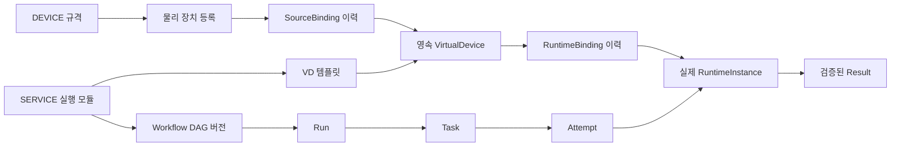

# 원 설계와 현재 구현 대조

기준은 [전체 설계도·API 도메인·ERD·실행 규칙](../architecture/sources.md)입니다.
이 문서는 설계 원칙, 현재 화면·API 연결, 추가 수용이 필요한 항목을 구분합니다.
개별 코드·시험 완료를 전체 M0–M10 수용 완료로 해석하지 않습니다.

## 리소스와 실행 흐름

원본 장치와 실행 노드는 별개입니다. VD는 원본·실행체 교체 후에도 같은 `vdId`를 유지합니다.
SERVICE는 실행 모듈의 불변 규격이고 Workflow는 모듈 간 의존성을 묶는 불변 DAG 버전입니다.
SERVICE를 등록하거나 DDS 배포를 저장하는 작업 자체가 VD를 만들지는 않습니다.

## 화면·API 연결

| 원 설계의 원칙 | 현재 연결 | 이번 정렬 내용 |
|---|---|---|
| DEVICE / SERVICE / VD 규격 구분 | `/profiles`, Profile API | 장치 규격·실행 모듈·가상 디바이스 템플릿 명칭과 입력 구분 |
| VD 템플릿의 종류·원본·SERVICE·상태·실행 정책 | VD 프로필 양식, VD 소비 계약 | 기본 `sensorMirror`·필수 LIVE 원본, 규격 참조 선택과 동시 작업/시작·종료 제한 입력 |
| 실제 원본과 템플릿 조건 분리 | `/virtual-devices`, VD 생성·수정 API | 템플릿 원본 키별 선택, 정확한 DEVICE 버전·허용 출처·ACTIVE 장치만 표시; 미연결 선택 원본 생략 |
| 영속 VD와 SourceBinding | VD 상세, 원본 변경 API·이력 | 원본 교체 후 ID 유지, 현재 연결과 닫힌 연결을 구분 |
| 별도 RuntimeBinding·RuntimeInstance | VD 실행 조회·기동·교체·drain·Operation API | 실행 세대·연결 기간·노드·Operation과 등록 상태를 구분 |
| SERVICE → WorkflowVersion → Run → Task·Attempt | `/workflows`, `/runs`, Workflow·Run·Task API | 기본 서비스 화면을 Spring DAG로 연결, 발행 버전과 실행 요청·상세 조회 유지 |
| kube-scheduler 최종 bind | SERVICE 자원·플랫폼 조건, Run AUTO/NODE, Placement | 관측 장비 적용 시 자원·아키텍처만 기본 반영; hostname 제한은 명시적 선택 |
| 결과 파일 검증 후 확정 | Task Result API·검증된 결과 패널 | 기존 검증 경로 유지; Pod 완료나 Operation 성공을 Result 완료로 표시하지 않음 |
| 변경의 불변 버전·revision·멱등성 | Profile/WorkflowVersion, Device/VD revision, 실행 요청 키 | 기존 백엔드 계약 유지; 템플릿 필수 조건은 전송 전 추가 검증 |

발행된 프로필은 내용 수정 대신 새 버전으로 변경합니다. 템플릿의 실행 정책은 현재 소비 계약의
`STATELESS`, 동시 작업 1–16, 시작·종료 제한 각 1–600초를 사용합니다. 상태형 복원을 지원한다고 표시하지 않습니다.

## 사용자 요청으로 유지하는 확장과 차이

- **DDS·GitOps 통합:** 기존 Platform-Service의 구조·Buildx·Gitea·Argo CD 연결을 유지합니다.
  `/workflows?mode=dds`에서 사용하며 기본 DAG 실행과 구분합니다. `?mode=dag`와 SERVICE·VD 직접 연결도 지원합니다.
- **로그인 없는 관리 화면:** 원 설계의 사용자 신원·권한 수용을 완료한 상태는 아닙니다.
  현재 사용자 요청에 따른 접근 정책과 CSRF·내부 실행 인증은 [접근 정책](access.md)을 따릅니다.
- **미사용 등록 삭제:** 해제·영구 삭제를 구분하고, 사용 중인 장치·프로필·VD는 참조 검사로 삭제를 막습니다.
- **실제 장비 관측:** Kubernetes 노드, Prometheus 메트릭, EdgeX 센서 목록·측정·명령·수동 등록 연결을 유지합니다.
  EdgeX 센서 등록은 앱 Device/Session 등록이나 VD 실행 입력 adapter의 자동 생성을 의미하지 않습니다.

## 남아 있는 수용 범위

| 항목 | 현재 경계와 다음 확인 |
|---|---|
| EdgeX → 실행 데이터 경로 | 센서 관리 API와 앱 Device/Session·source binding은 별개. 실제 입력 adapter의 데이터·session·순번 계약과 수용 필요 |
| 외부 Remote·2세부 연동 | 참조 제공자 구현과 실제 외부 시스템 API·오류·종료·결과 계약 수용을 구분 |
| 상태형 복원·STREAM 전체 조합 | 구현된 경로와 지원 조합 확인 필요; 이번 작업에서 Runner/STREAM 고도화·전체 수용을 수행하지 않음 |
| GPU/NPU·실모델 | 장착·자원 관측과 실제 모델의 이미지·라이브러리·실행·성능 검증은 별개 |
| 운영 identity/RBAC·성능·종합 복구 | 사용자별 권한, 합의된 성능 수치, 전체 재가동 수용은 [개발 단계](../../PLAN.md)의 잔여 항목 |
| 현재 실행 환경 반영 | 소스 수정과 현재 프로세스·DB·배포 반영은 별개; 앱 실행·재시작·배포는 사용자가 진행 |

세부 사용법: [VD 관리](../guides/virtual-devices.md), [DAG 실행](../guides/dag-execution.md),
[DDS·GitOps 배포](../guides/workflow-editor-integration.md).
이번 변경의 확인 조건은 [설계 정렬 검증](../evidence/design-alignment-2026-10-06.md)을 따릅니다.
